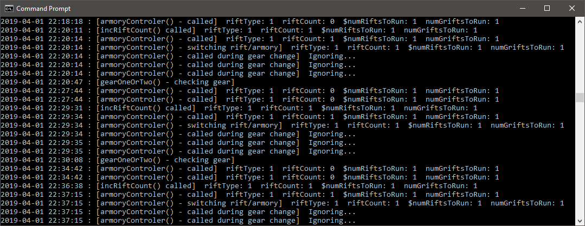
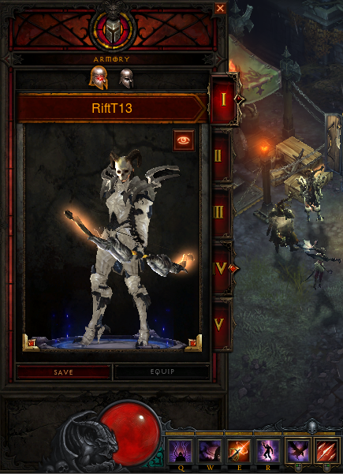
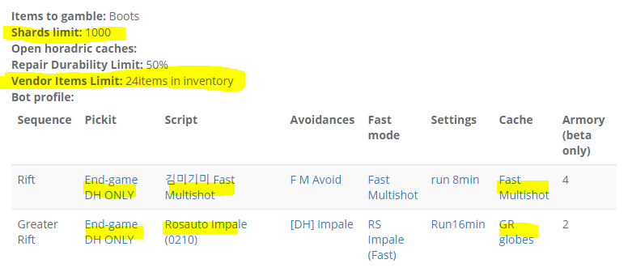
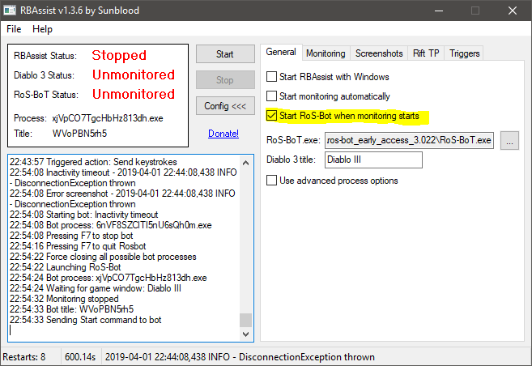
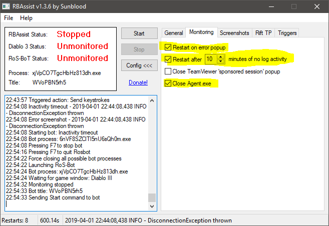
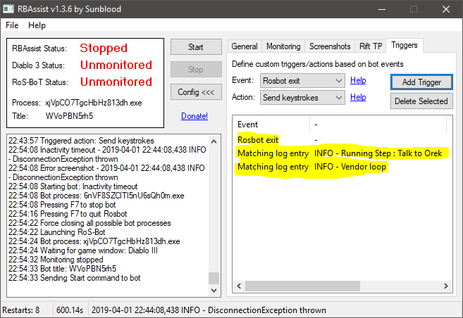
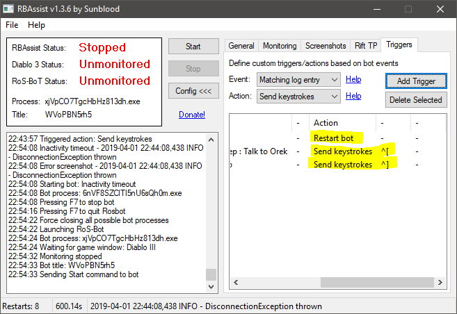
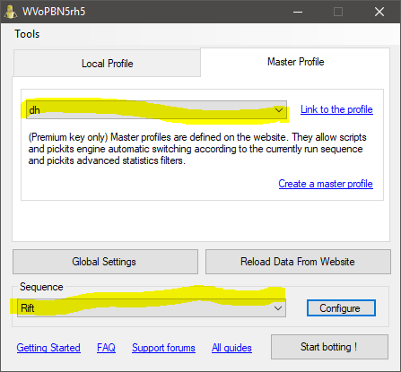
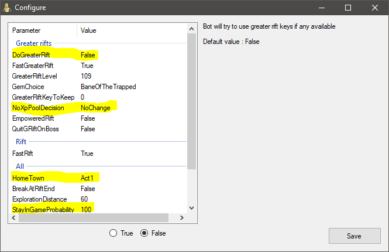

# Auto Armory 
*An Armory / Rift-Type changing script for ros-bot*

## About
* Script by: **djpurpose**
* Made possible by **RoSBot** and **RBAssist**
* Questions or suggestions I can be reached on Discord: `djpurpose#9880`
* This script is use at your own risk but if you follow the setup you should be fine.

## How it Works
1. Run the number of rifts specified.
2. Change armory / rift type
3. Run the number of grifts specified.
4. Change armory /rift type
5. Go to number step 1

## Requirements
1. This script
2. [rosbot](www.ros-bot.com) with premium license (for master profile)
3. [RBAssist - Bot Scheduling and Crash Recovery](https://www.ros-bot.com/forums/general-discussion/rbassist-bot-scheduling-and-crash-recovery-1376373)
4. Diablo 3 running on fast PC (not sure this would work in a vm without modification)
5. Running MultiShot / Impale Demon Hunter (can run other classes/builds with modifications)
6. Not running TurboHud (can run it with modification and I'll probably add this next version as I like TurboHud)

## Optional
1. [Autoit](https://www.autoitscript.com/cgi-bin/getfile.pl?autoit3/autoit-v3-setup.exe) 
2. [AutoIt Script Editor](https://www.autoitscript.com/site/autoit-script-editor/downloads/) for modifying the script. 

## How to Run
1. Make sure the entire "Setup / Install" is complete before starting.
2. Start Diablo 3 and change into your rift gear (armory 1)
3. Start RoS Bot and make sure DoGreaterRift is false, we always start in rift mode.
4. Start RBAssist.
5. Start autoArmory.exe in administrator mode (needed to control windows, mouse, keyboard). The script should detect the Diablo III window and activate it. If Diablo is not running the script will throw an error so make sure it's running before launching the script. 
6. The script should show in your taskbar. If you need to close the script you can right click the icon and click exit.
7. Once the script is running, click "Start" in RBAssist.
8. Hopefully you now have a working armory switcher. 

## Suggestions
1. Run the 1/2 script first (it might be the best fit anyways depending on your gear) then monitor the the bot. It should stop after the first successful rift and change gear / rift settings. **WARNING** Avoid using the mouse/keyboard at all costs when its changing gear. Any slight input can make it fail. 

2. If you are tech-savy I suggest installing the tail command into windows and doing a tail - f on the ArmoryLog.txt and showing on your screen, this can help debug any issues you might have. See screenshot:

 

## Setup / Install
1. Click the "Clone or Download" button then "Download Zip"
2. Extract the zip to a directory of your choice. 
3. Run Diablo III in windowed mode and make the window the minimum size (it will not work any larger than this without modification)
4. Make sure your Rift gear is in Armory 1 and Multishot is on the right mouse button. Make sure no items are missing.

 

5. Make sure your GRift gear is in Armory 2 and Impale is on the right mouse button. Make sure no items are missing.

 

6. Setup your Master Profile. Like shown. The purpose of these settings is to make sure there is no possible way to lose gems when changing gear. Vendor limit: 24 Items and a picket that doesn't sell gems.

  **To test:** Put a legendary gem and a flawless royal gem you don't care about in your inventory and run some rifts. If the bot correctly puts the gems in your stash then you should be good to go. 

  **NOTE:** In over a week of testing I never had an issue losing anything. The script only changes armory and restarts the bot. As long as your bot settings are correct you shouldn't have any trouble.

 

7. Assuming you have RBAssist setup already. In RBAssist General tab set "Start RoS-Bot when monitoring starts"

 

8. In RBAssist Monitoring tab set the following:

 

9. In RBAssist Triggers tab set the following Trigger/Actions Note that's `^[` and `^]` for the keystrokes to send:

 
 

10. In RoS Bot make sure to set your master profile, and rift as the Sequence:

 

11. In RoS Bot Config set the following settings. Note we always start the session in Rift mode so set DoGreaterRift to False:

 

## Troubleshooting
1. Subscript Error when loading script: The Diablo window is not open. Open Diablo before opeing the script

2. Doesnt change gear correctly. Most likely your window size is off or the timers are too short for your PC speed. Look at the logs to see where you you need to adjust.

3. Script is running a gr as multishot or a rift as impale. Can be a few things:
 * You didn't start things correctly, make sure you are wearing rift gear (multishot armory 1), make sure rosbot is set to not run grifts, exit any running autoArmory scripts and start a fresh one. This insures we are in the correct state when starting.

 * It might have changed gear ok but failed to change the rift type. Watch it closely to see where it failed.
